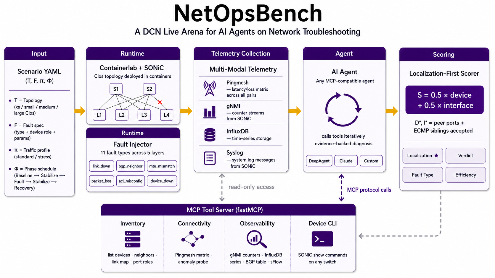
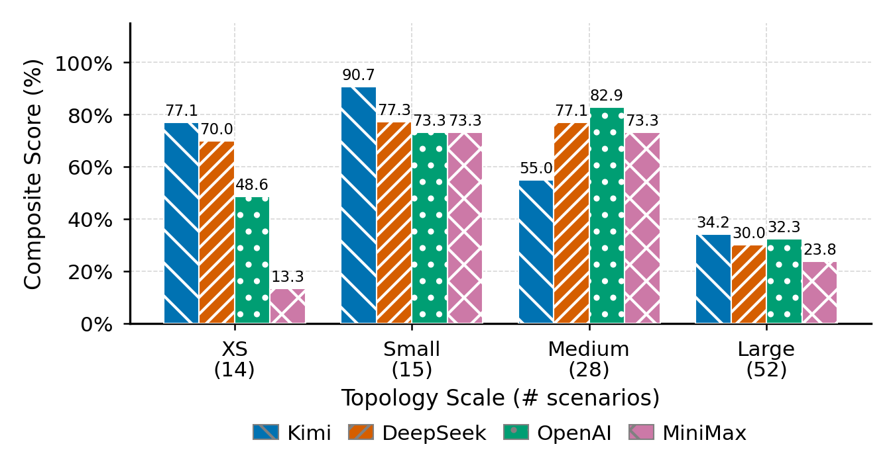

# NetOpsBench

<p align="center">
  <strong>An Interactive Arena for AI Infrastructure Diagnosis</strong>
</p>

<p align="center">
  <a href="https://github.com/NetX-lab/NetOpsBench/actions/workflows/test.yml"></a>
  <a href="https://github.com/NetX-lab/NetOpsBench/actions/workflows/docs-pages.yml"></a>
  <a href="https://www.python.org/downloads/"></a>
  <a href="LICENSE"></a>
</p>

<p align="center">
  <a href="https://netx-lab.github.io/NetOpsBench/">Documentation</a> ·
  <a href="docs/content/docs/getting-started/index.mdx">Quickstart</a> ·
  <a href="docs/content/docs/build-your-agent/custom-agents.mdx">Build Your Agent</a> ·
  <a href="docs/content/docs/benchmark/results.mdx">Benchmark Results</a>
</p>

## News

- **2026-05**: 🎉 **Initial Release** - NetOpsBench is now available as an open-source benchmark for closed-loop agentic DCN troubleshooting.
  - Public SDK with `run_scenario()` and `run_suite()` APIs
  - Custom diagnostic agent framework and examples
  - Scenario generation tooling for XS, Small, Medium, and Large topologies
  - Complete benchmark documentation and methodology
  - Cross-model evaluation results and scoring framework

NetOpsBench evaluates agentic RCA inside a real reproducible data-center network loop: build a SONiC-VS / Containerlab fabric, inject a controlled fault, observe Pingmesh and telemetry symptoms, call an agent, and score the diagnosis against ground truth.

It is built for researchers and engineers who want to compare LLM-backed, symbolic, heuristic, or hybrid troubleshooting strategies on the same operational benchmark, not just on static logs or hand-written prompts.



## Why It Matters

| Capability | What NetOpsBench gives you |
|---|---|
| Run the network, not just logs | Faults execute against live SONiC/Containerlab topologies with traffic and observability. |
| Bring any agentic strategy | Pass a Python object with `diagnose(context)` into the public SDK. |
| Score localization, not only detection | Measure fault type, device, interface, runtime, tool calls, and token cost. |
| Scale with isolated worker pools | Run suites across independent labs and merge results into one `BenchmarkReport`. |

## Quick Start

NetOpsBench runtime execution requires Linux because Containerlab depends on Linux networking primitives.

```bash
git clone https://github.com/NetX-lab/NetOpsBench.git
cd NetOpsBench

python -m venv .venv
source .venv/bin/activate
pip install -e ".[agent]"

netopsbench benchmark prepare --scales xs
export OPENAI_API_KEY=...
PYTHONPATH=. python examples/01_run_scenario.py --vendor openai
```

The first successful run should produce a `BenchmarkReport` with case-level scores, timing, and artifact paths. For Docker, Containerlab, and runtime setup details, read [Quickstart](docs/content/docs/getting-started/index.mdx).

## Run a Scenario YAML

```python
from examples.agents import MinimalDeepAgent
from netopsbench.sdk import NetOpsBench

scenario = "scenarios/generated/xs/generated_link_down_xs_001.yaml"

with NetOpsBench(workspace=".") as bench:
    agent = bench.agents.wrap(MinimalDeepAgent(vendor="openai"))
    run = bench.sessions.run_scenario(scenario=scenario, agent=agent)
    report = run.wait()

print(report.summary)
```

Scenario YAML files define the benchmark case: topology scale, traffic profile, fault type, target device, and interface-level ground truth when applicable. Use [Python API Guide](docs/content/docs/api/quickstart.mdx) for `run_scenario(...)`, `run_suite(...)`, and `workers=N`; use [Custom Diagnostic Agents](docs/content/docs/build-your-agent/custom-agents.mdx) when you are ready to replace `MinimalDeepAgent` with your own RCA strategy.

## Benchmark What Matters

NetOpsBench reports detection, fault type, device/interface localization, runtime, tool calls, and token usage so agent quality and operational cost can be compared together.



Read [Benchmark Methodology](docs/content/docs/benchmark/methodology.mdx) for scoring definitions and [Benchmark Results](docs/content/docs/benchmark/results.mdx) for an example completed suite.

## Learn More

| Goal | Start here |
|---|---|
| Run one scenario | [Quickstart](docs/content/docs/getting-started/index.mdx) |
| Understand the benchmark loop | [System Overview](docs/content/docs/architecture/system-overview.mdx) |
| Understand parallel execution | [Worker Pool Execution](docs/content/docs/architecture/worker-pool-execution.mdx) |
| Use NetOpsBench from Python | [Python API Guide](docs/content/docs/api/quickstart.mdx) |
| Plug in your own RCA agent | [Custom Diagnostic Agents](docs/content/docs/build-your-agent/custom-agents.mdx) |
| Interpret benchmark scores | [Benchmark Methodology](docs/content/docs/benchmark/methodology.mdx) |
| Deploy or inspect observability | [Operations](docs/content/docs/operations/deployment.mdx) |

## Contributing

Contributions are welcome for benchmark scenarios, fault types, SDK ergonomics, documentation, and evaluation workflows. For development setup and PR expectations, see [CONTRIBUTING.md](CONTRIBUTING.md).

## License

NetOpsBench is released under the MIT License. See [LICENSE](LICENSE).

## Citation

If you use NetOpsBench in your research, please cite:

```bibtex
@software{netopsbench2026,
  author  = {Yang, Yitao and Xu, Hong},
  title   = {{NetOpsBench}: An Interactive Arena for Agentic RCA in AI infrastructure},
  year    = {2026},
  url     = {https://github.com/netx-lab/NetOpsBench},
}
```
