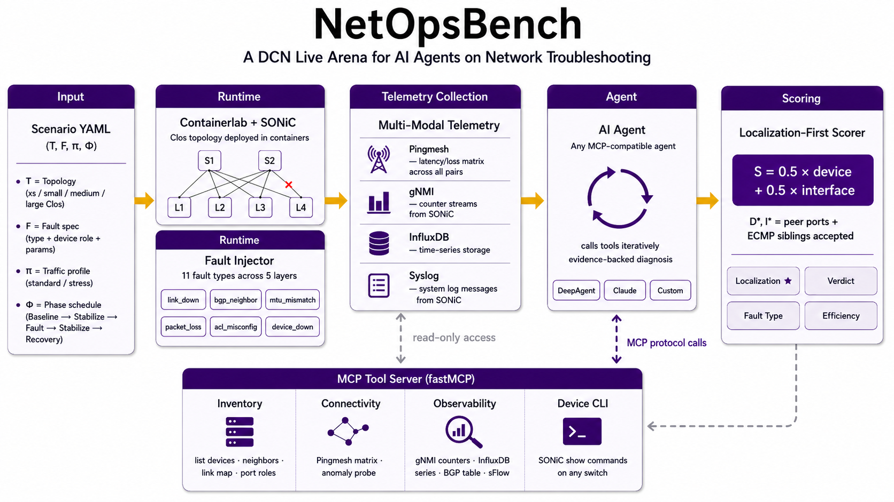
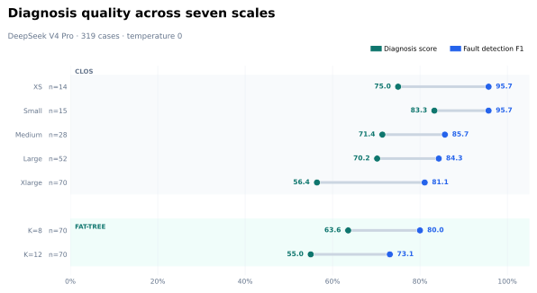
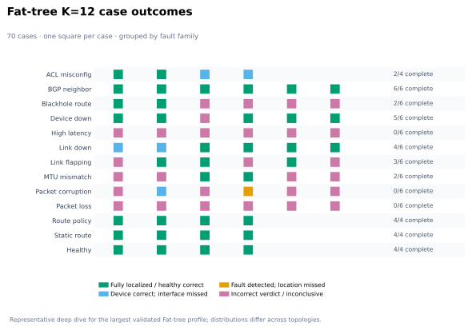

# NetOpsBench: Open Arena for NetOps in AI Infrastructure

<p align="center">
  <strong>Fair, reproducible benchmarks for agentic network troubleshooting.</strong>
</p>

<p align="center">
  <a href="https://github.com/NetX-lab/NetOpsBench/actions/workflows/test.yml"></a>
  <a href="https://github.com/NetX-lab/NetOpsBench/actions/workflows/docs-pages.yml"></a>
  <a href="https://www.python.org/downloads/"></a>
  <a href="LICENSE"></a>
  <a href="https://join.slack.com/t/netopsbench/shared_invite/zt-3zhhfangj-2U4dU_NSfCy1rcOM1dmuvQ"></a>
  <a href="https://applink.feishu.cn/client/chat/chatter/add_by_link?link_token=595v4390-2a51-4db0-baa4-811821b47448"></a>
</p>

<p align="center">
  <a href="https://netx-lab.github.io/NetOpsBench/">Website</a> ·
  <a href="https://netx-lab.github.io/NetOpsBench/docs/quickstart/">Quickstart</a> ·
  <a href="https://netx-lab.github.io/NetOpsBench/docs/build-your-agent/custom-agents/">Build Your Agent</a> ·
  <a href="https://huggingface.co/datasets/yyyyyt/netopsbench-trace">Trace Dataset</a>
</p>

NetOpsBench is an open benchmark arena for agentic network troubleshooting — run reproducible fault scenarios on live SONiC-VS / Containerlab topologies, plug in any troubleshooting agent, and score it across quality and efficiency dimensions.

## Why NetOpsBench

Troubleshooting agents are difficult to compare when the network, incident, and evidence change from run to run. NetOpsBench turns those variables into a controlled live benchmark:

- **Reproducible incidents** — labeled faults run against repeatable SONiC-VS and Containerlab topologies.
- **Interactive evidence** — agents inspect live Pingmesh, BGP, gNMI, syslog, and switch state instead of static logs.
- **Comparable outcomes** — one evaluator measures detection, localization, efficiency, and tool use across agent strategies.

## Overview

NetOpsBench provides: (1) an interactive and realistic environment mimicking production networks, with common tracing and telemetry tooling; (2) comprehensive and reproducible benchmarks covering a wide range of faults and failures; (3) an extensible architecture with an open SDK to readily integrate with various agent paradigms and observability tools, allowing users to try out their own agentic workflows.

It is built for researchers and engineers who want to compare LLM-backed, symbolic, heuristic, or hybrid troubleshooting strategies on the same operational benchmark, not just on static logs or hand-written prompts.



## News

- **2026-08**: 🚀 **NetOpsBench v0.2.0** - Large-topology benchmark release.
  - Add Xlarge CLOS and Fat-tree K=8/K=12 profiles, with 70 generated cases per large topology.
  - Replace per-client Python Pingmesh and iperf processes with the native Rust client agent for Pingmesh and background traffic.
  - Harden large-topology fault injection, recovery, observability, and exact runtime teardown.
  - Publish a versioned DeepSeek validation snapshot across all seven supported scales. See the [v0.2.0 release notes](docs/content/docs/releases/v0.2.0.mdx).
- **2026-05**: 🎉 **Initial Release** - NetOpsBench is now available as an open arena for agentic network troubleshooting.
  - Provide public SDK with `run_scenario()` and `run_suite()` APIs to launch live network environments from Python.
  - Equip native MCP tools of complete observability utilities and pre-configured SONiC-VS network covering XS, Small, Medium and Large scales.
  - Offer fault scenario generation scripts and an expanding repository of reproducible fault cases with standard ground truth labels.
  - A full-fledged benchmark evaluator that accesses detection accuracy and token utilization efficiency.

## Quick Start

> NetOpsBench runtime execution requires Linux because Containerlab depends on Linux networking primitives.

### Install and run via CLI

```bash
git clone https://github.com/NetX-lab/NetOpsBench.git
cd NetOpsBench

python -m venv .venv
source .venv/bin/activate
pip install -e ".[agent]"

netopsbench benchmark prepare --scales xs
export OPENAI_API_KEY=...
PYTHONPATH=. python examples/01_run_scenario.py --vendor openai
```

The first successful run produces a `BenchmarkReport` with case-level scores, timing, and artifact paths. For Docker, Containerlab, and runtime setup details, read [Quickstart](docs/content/docs/quickstart.mdx).

### Run a scenario from Python

```python
from examples.agents import MinimalDeepAgent
from netopsbench.sdk import NetOpsBench

scenario = "scenarios/generated/xs/generated_link_down_xs_001.yaml"

with NetOpsBench(workspace=".") as bench:
    agent = bench.agents.wrap(MinimalDeepAgent(vendor="openai"))
    run = bench.sessions.run_scenario(scenario=scenario, agent=agent)
    report = run.wait()

print(report.summary)
```

Scenario YAML files define the benchmark case: topology scale, traffic profile, fault type, target device, and interface-level ground truth when applicable. Use the [Python API Guide](docs/content/docs/build-your-agent/python-api-guide.mdx) for `run_scenario(...)`, `run_suite(...)`, and `workers=N`; see [Custom Troubleshooting Agents](docs/content/docs/build-your-agent/custom-agents.mdx) when you are ready to replace `MinimalDeepAgent` with your own strategy.

## Benchmark Results

NetOpsBench reports detection, fault type, device/interface localization, runtime, tool calls, and token usage so troubleshooting quality and operational cost can be compared together.

| Scale | Topology | Switches | Clients | Cases |
|---|---|---:|---:|---:|
| XS | CLOS | 4 | 2 | 14 |
| Small | CLOS | 6 | 8 | 15 |
| Medium | CLOS | 12 | 16 | 28 |
| Large | CLOS | 20 | 64 | 52 |
| Xlarge | CLOS | 144 | 128 | 70 |
| Fat-tree K=8 | Fat-tree | 80 | 128 | 70 |
| Fat-tree K=12 | Fat-tree | 180 | 144 | 70 |

**Diagnosis score** is the mean end-to-end case score: healthy cases require the correct verdict, while fault cases receive localization credit only after the fault is detected. **Fault detection F1** measures the fault-versus-healthy decision independently.



The largest validated Fat-tree profile provides a compact case-level view. Each square below is one K=12 case; detailed cross-topology observability analysis remains in the full results.



Read the [v0.2.0 release notes](docs/content/docs/releases/v0.2.0.mdx), [Benchmark Methodology](docs/content/docs/run-benchmarks/methodology.mdx), and [Benchmark Results](docs/content/docs/run-benchmarks/results.mdx) for the full validation snapshot and scoring definitions.

The public [NetOpsBench Trace Dataset](https://huggingface.co/datasets/yyyyyt/netopsbench-trace) contains both the earlier cross-model snapshot and the [v0.2 seven-scale release](https://huggingface.co/datasets/yyyyyt/netopsbench-trace/tree/main/releases/netopsbench-0.2): 319 validated DeepSeek Harbor/ATIF trajectories across XS through Fat-tree K=12. Aggregate metrics and immutable publication provenance are recorded in the [v0.2 result snapshot](docs/public/assets/benchmark/deepseek_v02_release.json).

## Learn More

| Goal | Start here |
|---|---|
| Run one scenario | [Quickstart](docs/content/docs/quickstart.mdx) |
| Run scenarios, suites, and batches | [Running Benchmarks](docs/content/docs/run-benchmarks/run-scenario-vs-suite.mdx) |
| Plug in your own troubleshooting agent | [Custom Troubleshooting Agents](docs/content/docs/build-your-agent/custom-agents.mdx) |
| Use NetOpsBench from Python | [Python API Guide](docs/content/docs/build-your-agent/python-api-guide.mdx) |
| Interpret benchmark scores | [Benchmark Methodology](docs/content/docs/run-benchmarks/methodology.mdx) |
| Debug observability or runtime state | [Operations](docs/content/docs/debug-operate/observability.mdx) |
| Understand the benchmark loop | [System Overview](docs/content/docs/architecture/system-overview.mdx) |

## Community

- Global community: [NetOpsBench Slack](https://join.slack.com/t/netopsbench/shared_invite/zt-3zhhfangj-2U4dU_NSfCy1rcOM1dmuvQ)
- Chinese-language community: [NetOpsBench Feishu group](https://applink.feishu.cn/client/chat/chatter/add_by_link?link_token=595v4390-2a51-4db0-baa4-811821b47448)

## License

NetOpsBench is released under the MIT License. See [LICENSE](LICENSE).

## Citation

If you use NetOpsBench in your research, please cite:

```bibtex
@software{netopsbench2026,
  author  = {Yang, Yitao and Xu, Hong},
  title   = {{NetOpsBench}: Open Arena for NetOps in AI Infrastructure},
  year    = {2026},
  url     = {https://github.com/netx-lab/NetOpsBench},
}
```
